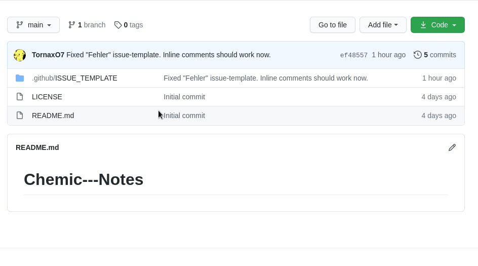
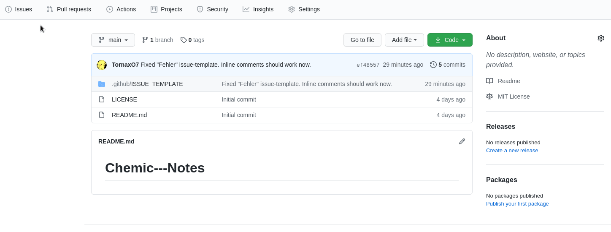

## Advice

This repo includes my chemic notes for **my classmates (from germany)** so I
won't translate it into another language, sorry.

#### Wo ist die Datei? (Dein "Aufschrieb")

Die Datei die ihr sucht, heißt `main.pdf`.

## Wie kann ich mir dein Zeug herunterladen?

Hier die Anleitung in Worten:

1. Auf den grünen Knopf "Code" drücken.
2. Auf "Download ZIP" drücken und herunterladen.
3. Anschließend noch entzippen.
4. Fertig :D

Hierfür habe ich auch ein kleines Anleitungs-GIF gemacht:

# Ich möchte etwas beitragen

Super! Es gibt 2 verschiedene Wege es zu tun:

## Einen "Issue" erstellen

Mithilfe eines Issues könnt ihr mir eine Nachricht schreiben, was ich
verändern/hinzufügen könnte. Einen Issue zu erstellen wäre mir lieber als per
Whatsapp oder Discord, weil das dann auch bei mir "angemerkt" wird.

Diese Schritte müsstet ihr machen:

1. Unter dem Namen `Tornax/Chemic-Notes` steht in der Leiste `Issues`. Dort
   draufdrücken.
2. Guckt zuerst nach, ob schon ein Issue offen ist, welches den gleichen Inhalt
   hat, wie eure Nachricht.
3. Wenn es so einen Issue schon gibt, dann könnt ihr wieder zurück gehen und
   hoffen, dass dieser gefixt wird. Ansonsten geht ihr auf den grünen Knopf 
   `New issue`.
4. Dort könnt ihr dann ein Issue auswählen. Je nachdem was ihr sagen wollt.
   **(Bitte die Felder ausfüllen!)**
5. Anschließend einfach unten rechts auf den grünen Knopf `Submit new issue`
   drücken und ihr seid fertig. ^^

Auch hier habe ich ein kleines Tutorial-GIF erstellt:

## Selber den Text editieren

### Wie kann ich es verändern?

Also wenn ihr diesen Weg wirklich nimmt, dann Respekt und vielen Dank! Hierfür würde ich euch
aber [dieses Video](https://www.youtube.com/watch?v=_NrSWLQsDL4)
empfehlen, um "herauszufinden" wie ihr mein Zeug verändern könnt. Die
Alternative wäre, dass ihr einfach einen Github-Account erstellt und ich euch
dann "einlade", sodass ihr dann direkt die Änderungen vornehmen könnt (ich habe das
jedoch nicht probiert und weiß daher nicht, ob das so klappen wird). In dem
Video erklärt er das eigentlich sehr verständlich, wie ihr über den sogenannten
"Fork" das Zeug verändert und dann "abschickt". Den Theorieteil könnt ihr
eigentlich getrost ignorieren.

### Reinschreiben

Diesen Aufschrieb habe ich mit [LaTeX](https://www.latex-project.org/) (nein,
nicht diese Gummi-Kleidung oder was auch immer das ist, lol) geschrieben. 
Auch wenn es verdammt lange ist, wäre 
[dieses Video](https://www.youtube.com/watch?v=VhmkLrOjLsw) ein guter Crash-Kurs 
zu LaTeX.

### Editor und Packet

Hier wäre [ein Editor](https://www.texstudio.org/) (Texstudio) für LaTeX den man
beispielsweise verwenden könnte und weil ich in diesem Fall das Packet
[chemfig](https://www.ctan.org/pkg/chemfig) für den Aufschrieb verwende, ist
[hier](https://mirror.clientvps.com/CTAN/macros/generic/chemfig/chemfig-en.pdf)
die Dokumentation dazu.
